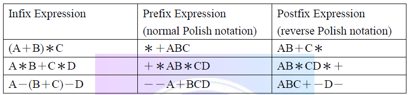
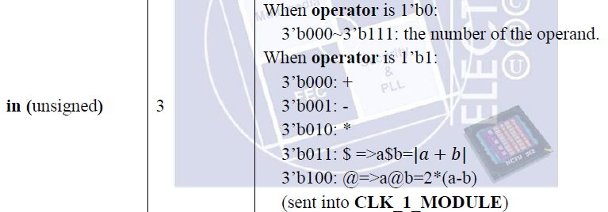
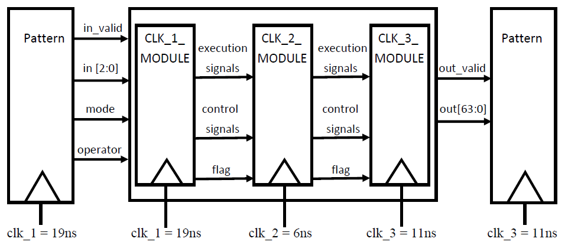
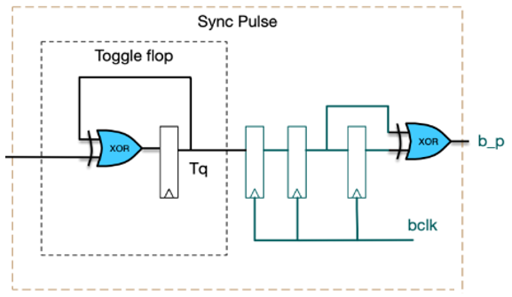
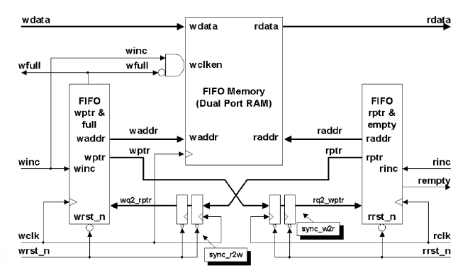
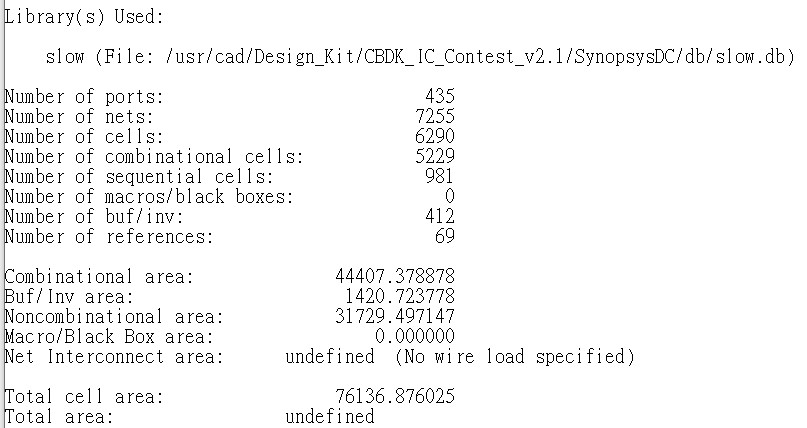

# Polish Notation

## PN introduction

- prefix

  

    
  

- postfix

  

    
  

- infix

  

    
  

### example

  

## spec

  

  

## CDC

- Pulse Synchronizer

  

- AFIFO

  

## Result

- Area  

  

    
  
